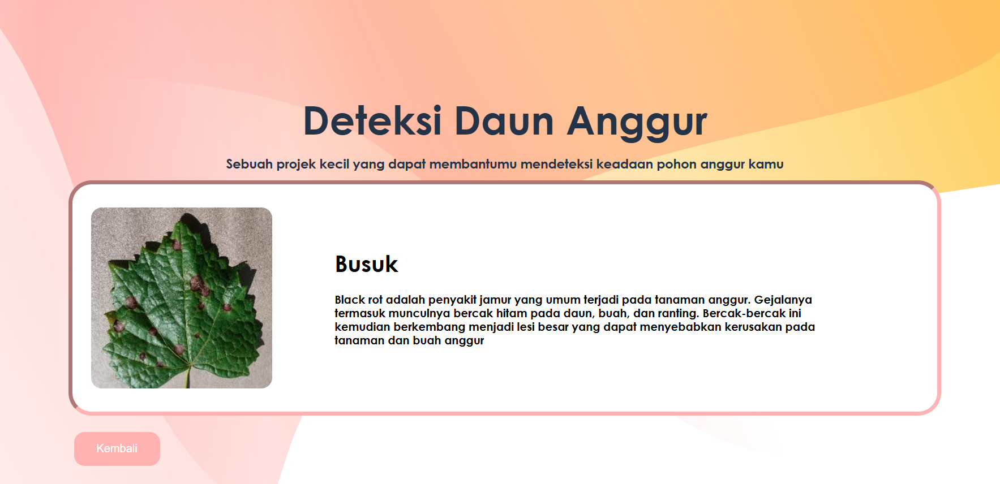

# Grape Leaf Classification using EfficientNet

# Penggunaan Model EfficientNet
EfficientNet: Model deep learning yang terkenal dengan efisiensinya dalam menangani tugas klasifikasi gambar. EfficientNet dirancang untuk mencapai performa tinggi dengan parameter yang lebih sedikit dibandingkan model konvensional lainnya.
# Dataset 
Dataset yang kami gunakan [PlantVillage Dataset](https://data.mendeley.com/datasets/tywbtsjrjv/1).
Artikel [EfficientNetV2](https://arxiv.org/pdf/2104.00298).
# Kontributor

Kami ingin mengucapkan terima kasih kepada orang-orang berikut atas kontribusi mereka:

- [Ilham](https://github.com/iya777)
- [gabrielbjb](https://github.com/gabrielbjb)
