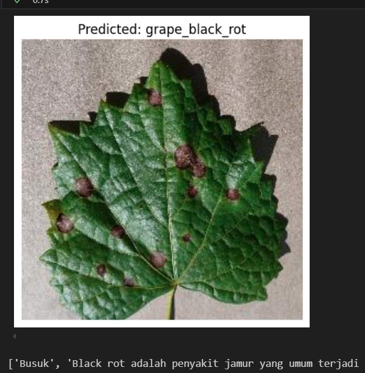

# Grape Leaf Classification using EfficientNet

# EfficientNet for Image Classification: Usage Guide
1. Download [trained model](trained_model.zip).
2. Download [Process](Process.ipynb).
3. You can use this image for testing. [TestingDataset](Testing.zip).
   
# Dataset 
Datasets we use [PlantVillage Dataset](https://data.mendeley.com/datasets/tywbtsjrjv/1).
Article [EfficientNetV2](https://arxiv.org/pdf/2104.00298).
# Contributors

We would like to thank the following people for their contributions:

- [Ilham](https://github.com/iya777)
- [gabrielbjb](https://github.com/gabrielbjb)
